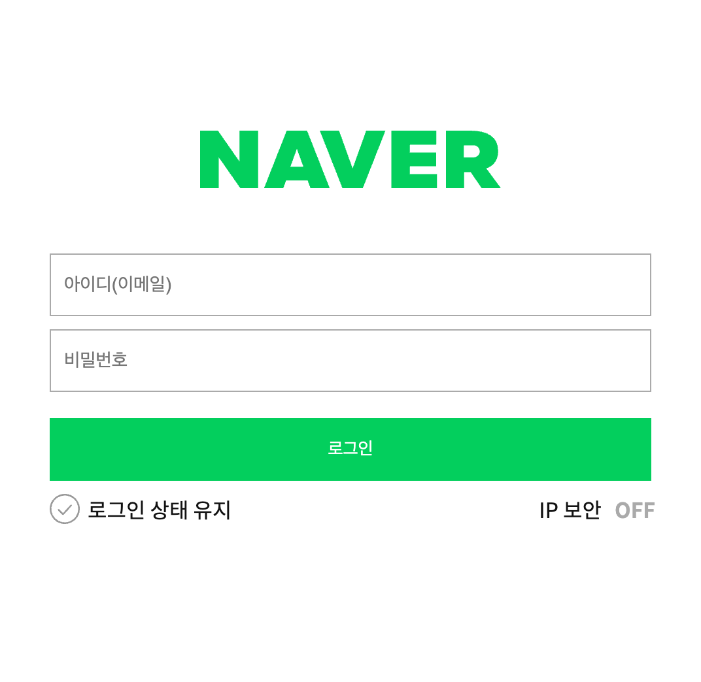
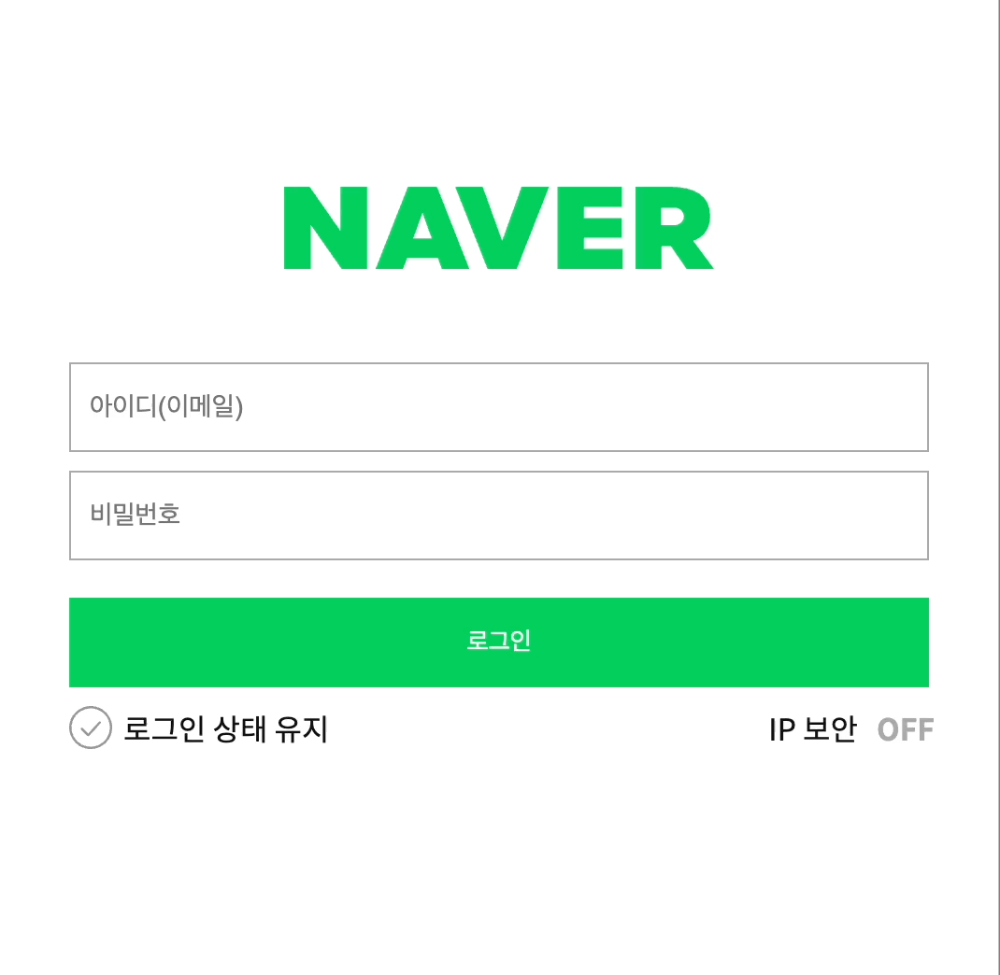
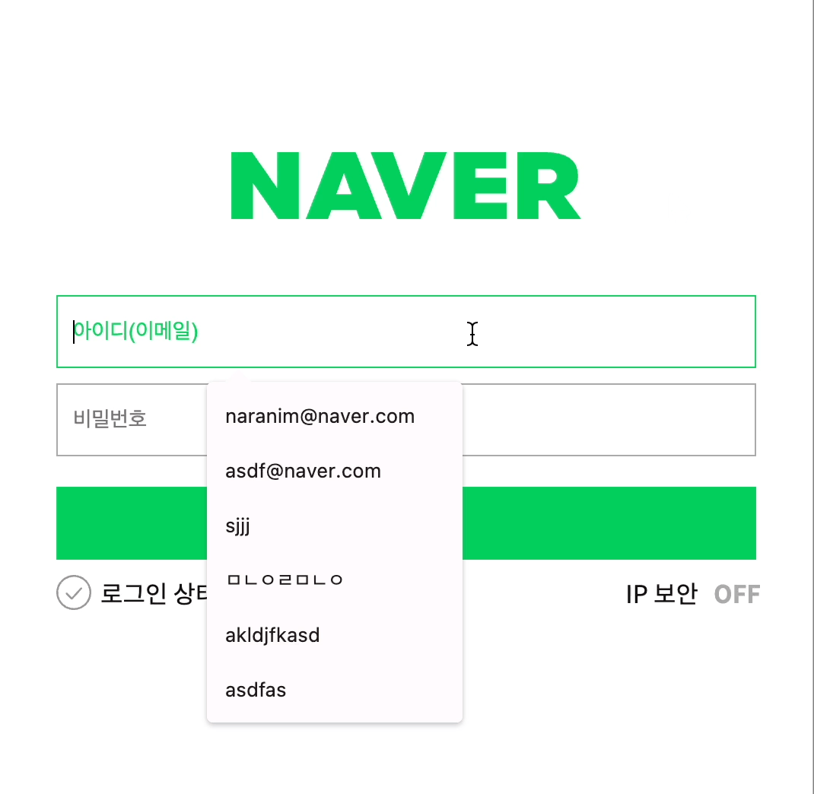

    

# 네이버 로그인 페이지 구현

---

로그인과 비밀번호를 정확히 입력했을 때 welcome 페이지로 넘어갈 수 있도록 코드 로직을 작성합니다.

---

## 💡주요 기능

**1. 공백 상태에서 로그인 버튼 클릭 시 에러 메시지 노출**

**2. email, password 유효성 검사 
email : email 형식 일치 확인 
password : 알파벳, 숫자, 특수문자(!@#$%^*+=-)가 최소 하나씩 존재해야 하며 길이는 6자~16자 사이인 형식에 일치하는지 확인**

**3. email 혹은 password가 일치하지 않거나 유저 정보에 존재하지 않는 email 입력 시 경고창 팝업**

---

- [x] 재사용 가능한 함수를 분리하고 함수를 중심으로 설계하는 방법에 대해 학습합니다.
